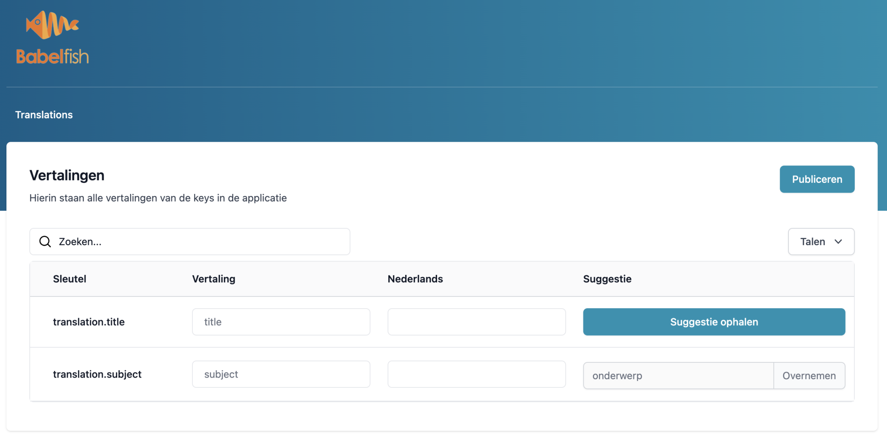
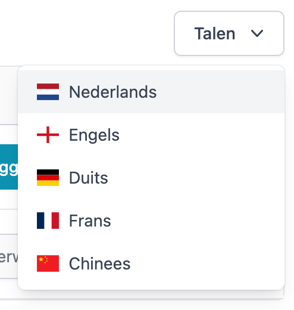

<p align="center">Laravel Babelfish<br/>
"A universal translator in the form of a package that you stick in your Laravel"</p>
<p style="text-align: center">
    <a href="https://github.com/sqits/laravel-babelfish/releases" title="Latest Stable Version">
        
    </a>
    <a href="/LICENSE.md" title="License: MIT">
        
    </a>
</p>



Ensure all your application is translated in all your languages. 

Found this package helpful? Please consider supporting our work!

## Features

+ Unlimited number of translations and languages
+ Get suggestions from third party services and AI
+ All translations are stored in the database


## Compatibility

| Laravel version |
|---|
| ^8.0 &#124; ^9.0 |


## Installation

With a Laravel 9.0 installation, use the following commands : 

```bash
composer require sqits/laravel-babelfish 
php artisan babelfish:install
```

After installation, point your browser to `http://localhost/babelfish` for the translation table.

## Usage

### Manage translations 

Babelfish shows all the translation [short keys](https://laravel.com/docs/9.x/localization) from the laravel code base. Suggestions are provided on the right, for fast work; manual translation is always available for sophisticated translations. Translations are stored in the database.


Change from one language to another easily, with the rightside menu. 



### Manage languages 

Add, remove, update languages for translations. 

## Testing

RFU.

```bash
composer test
```

## Configuration

+ `TBA` : set the route to the translation table. Default to 'babelfish'

## Changelog

Please see [CHANGELOG](CHANGELOG.md) for more information on what has changed recently.

## Contributing

Please see [CONTRIBUTING](CONTRIBUTING.md) for details.

## Security

If you discover any security-related issues, please [email](mailto:info@sqits.nl) to info@sqits.nl instead of using the issue tracker.

## Credits

- [Sqits](https://github.com/sqits)
- [Lex](https://github.com/rschaaphuizen)
- [Roderick](https://github.com/rschaaphuizen)
- [Ruud Schaaphuizen](https://github.com/rschaaphuizen)
- [All Contributors](../../contributors)

## License

The MIT License (MIT). Please see [License File](LICENSE.md) for more information.
